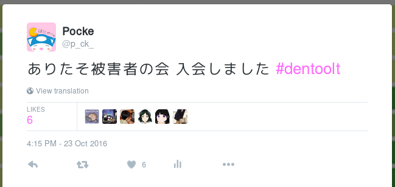
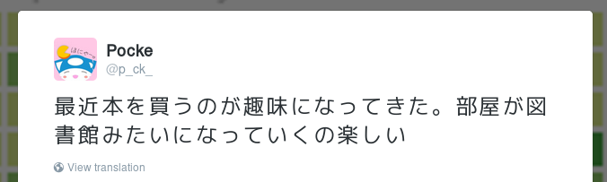
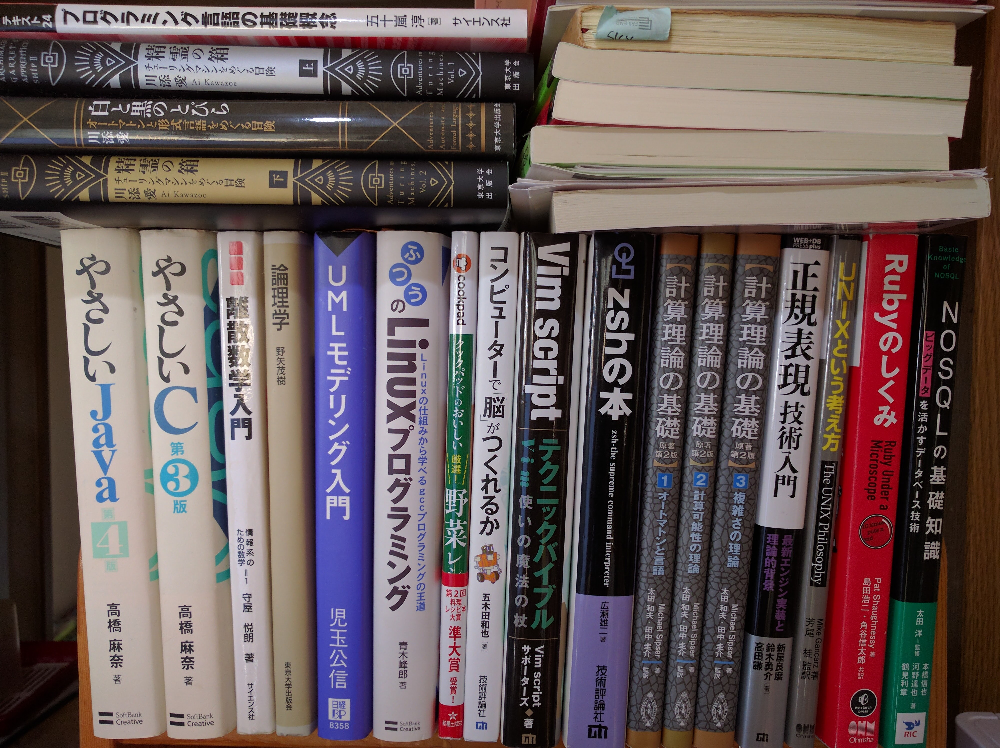
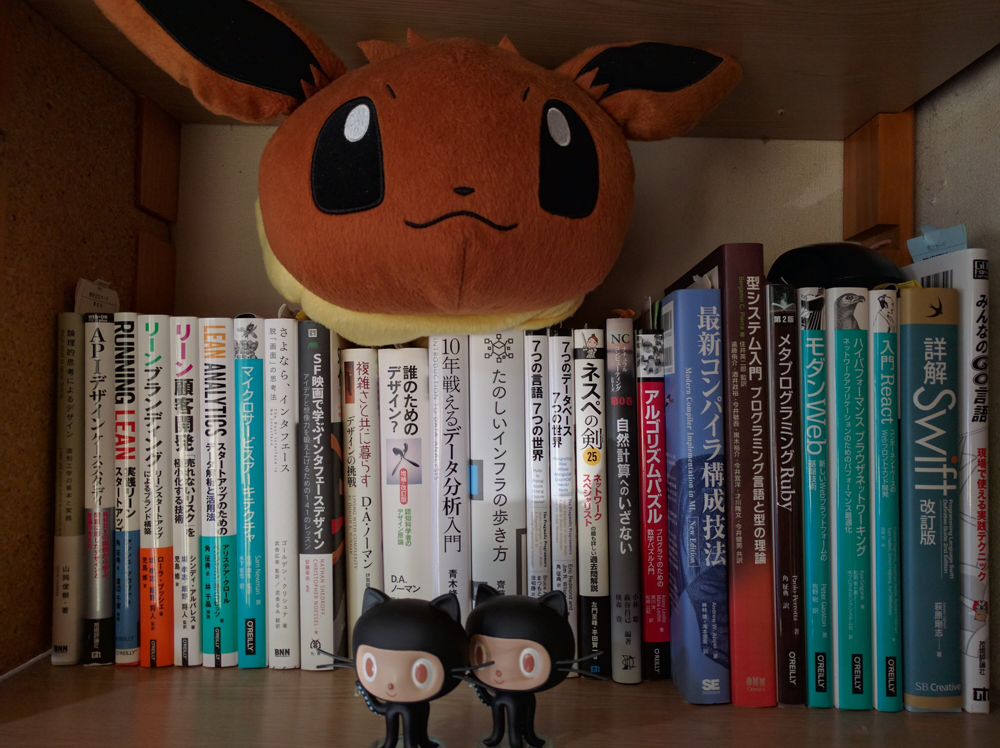
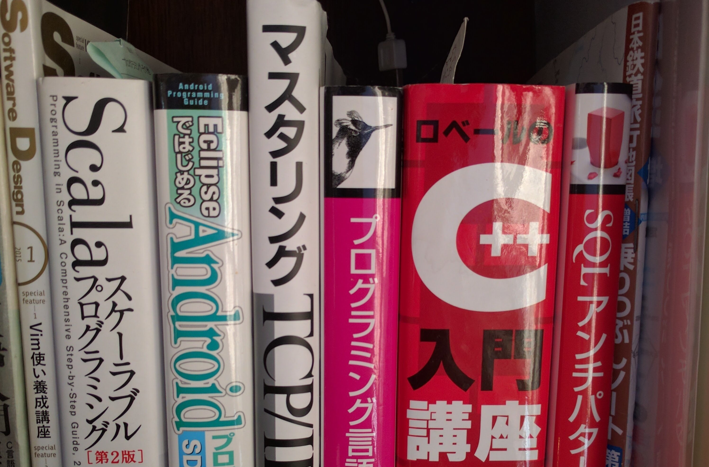
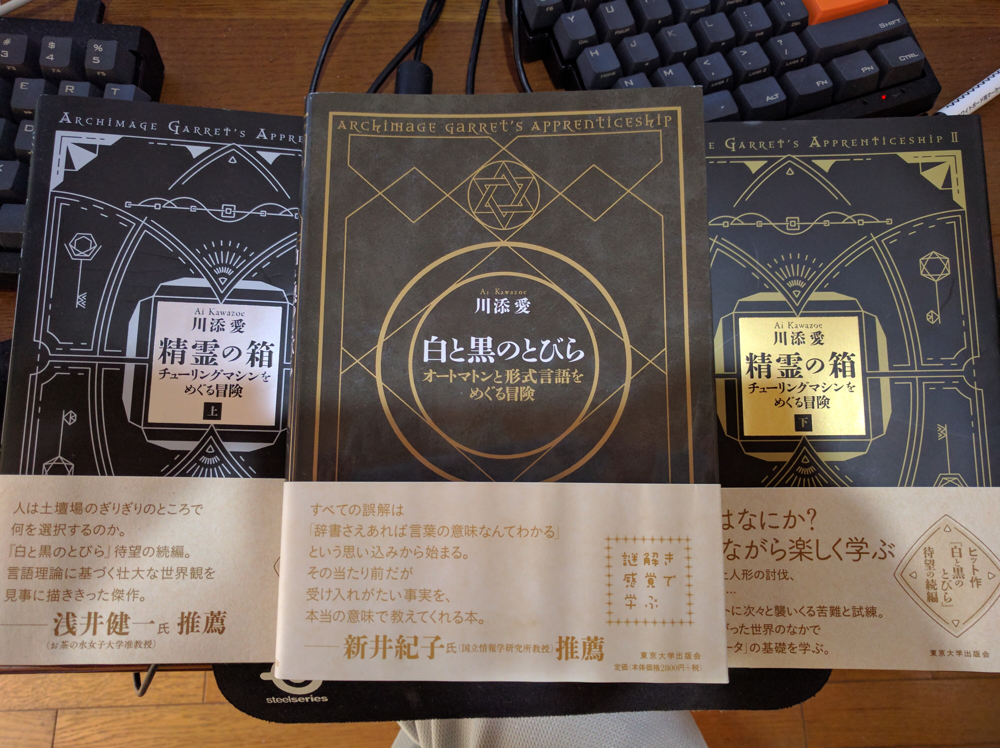

## Pockeが1バン好きなこと 


---

# だれこれ

---


# 


## Masataka Kuwabara (a.k.a. pocke)

- Actcat Inc. <i class="em em-cat"></i>
- The Open University of Japan
- Cookpad Summer Internship 2016


---


# 近況

---

## インターン行ってました

- エイチーム
  - 優勝した <i class="em em-muscle"></i>
- mixi
  - ホットチョコミントおいしかった <i class="em em-heart"></i>


---


## ありたそ被害者の会に<br>入会しました




---


### 1バン好きなこと<i class="em em-two_hearts"></i>
<!-- -attr- data-background="#ED5358" -->

---

### なんだろう…
<!-- -attr- data-background="#ED5358" -->

---

### .｡oO(好きなことは多く呟いているのでは…)
<!-- -attr- data-background="#ED5358" -->

---


### しらべてみた <i class="em em-hatching_chick"></i>
<!-- -attr- data-background="#ED5358" -->

---

<!-- -attr- data-background="#ED5358" -->

1. http://twilog.org/ から過去ツイート一覧のcsvをダウンロード
1. シェル芸 <i class="em em-star2"></i>
  1. `ruby`でCSVをパース
  1. ツイートの本文だけ取り出す
  1. 最新5000ツイートを抽出
  1. MeCab + neologd で形態素解析
  1. 名詞だけ取り出す
  1. 出現数をカウントしてソート

※注 Ruby で Python のコードを生成していません

---

<!-- -attr- data-background="#ED5358" -->

### こんなかんじ <i class="em em-rocket"></i>

```sh
$ < p_ck_161101.csv | 
  ruby -rcsv -e '
  CSV.parse($<){|row|
    puts row[2].gsub(/\@[a-zA-Z0-9_]+/, "").gsub(%r!https?://\S+!, "")
  }' | 
  head -5000 | docker run -i docker-mecab-neologd:latest | 
  grep '名詞' | cut -f 1 | sort | grep -v '^.$' |
  ruby -e '
  c = 1; p = nil;
  while gets
    if $_.chomp==p then c+=1 else puts "#{c} #{p}"; c=1; p=$_.chomp end
  end' |
  sort -nr | head -30
```


Thanks <i class="em em-two_hearts"></i> [nownabe/docker-mecab-neologd](https://github.com/nownabe/docker-mecab-neologd)


---


<!-- -attr- data-background="#ED5358" -->

### けっか <i class="em em-cat"></i>

```
117 感じ
115 自分
103 NowPlaying
101 最近
92 RuboCop
91 人間
86 Ruby
75 好き
71 今日
70 奥華子
69 RT
66 便利
59 dentoolt
56 最高
55 PR
50 問題
49 時間
48 必要
48 ーー
47 Rails
45 会社
44 気分
41 気持ち
39 開発
38 GitHub
38 git
37 英語
37 体調
37 一切
35 明日
35 PC
34 Slack
32 実行
30 仕事
29 お金
28 名前
28 SideCI
27 完全
26 設定
26 学生
```

---


<!-- -attr- data-background="#ED5358" -->

## 結論

---


<!-- -attr- data-background="#ED5358" -->

- NowPlaying 多め <i class="em em-notes"></i>
- RuboCop / Ruby 好き <i class="em em-gem"></i>
- 奥華子最高!!! <i class="em em-two_hearts"></i>


---

<!-- -attr- data-background="#ed538e" -->

# 閑話休題

---

<!-- -attr- data-background="#ed538e" -->

# 実は今までの話は前置き


---

<!-- -attr- data-background="#ed538e" -->

## 本題: <br>今私が一番好きで<br>話したいこと！！

---


<!-- -attr- data-background="#ed538e" -->

# 本

### <i class="em em-book"></i><i class="em em-book"></i><i class="em em-book"></i><i class="em em-book"></i><i class="em em-book"></i><i class="em em-book"></i>

---


### 本を買うのが好き <i class="em em-money_with_wings"></i>

<!-- -attr- data-background="#ed538e" -->



---

<!-- -attr- data-background="#ed538e" -->

### 本棚の様子 <i class="em em-eyes"></i>


---

<!-- -attr- data-background="#ed538e" -->
# 

---

<!-- -attr- data-background="#ed538e" -->
# 

---

<!-- -attr- data-background="#ed538e" -->
# 

---

<!-- -attr- data-background="#ed538e" -->
### 50冊以上あった <i class="em em-money_with_wings"></i>

---

<!-- -attr- data-background="#ed538e" -->
### 特に好きな本 <i class="em em-heartbeat"></i>

---

<!-- -attr- data-background="#ed538e" -->
# 白と黒のとびら

最近続編も出たよ <i class="em em-star2"></i>

---


<!-- -attr- data-background="#ed538e" -->
# 

---

<!-- -attr- data-background="#ed538e" -->
### どんな本？


---

<!-- -attr- data-background="#ed538e" -->
## 白と黒のとびら


- 言語理論
  - 正則言語 / 有限オートマトン
    - 決定性 / 非決定性
  - 文脈自由言語 / プッシュダウンオートマトン
  - ポンピング補題
  - 文脈自由文法とオートマトンの等価性
  - 文脈自由言語の構文解析
  - 文脈依存言語 / 線形拘束オートマトン
  - チューリングマシン


---

<!-- -attr- data-background="#ed538e" -->
## 精霊の箱(続編)

- チューリングマシン
  - チューリングマシンでの実装
    - 文字列のマッチング
    - 二進法の表現
    - 足し算、掛け算
    - 文字列の複製
  - 情報の符号化
  - 万能チューリングマシンの概要
  - 停止性問題
  - 暗号理論


---


<!-- -attr- data-background="#ed538e" -->
### むずかしそう… <i class="em em-scream_cat"></i><i class="em em-scream_cat"></i><i class="em em-scream_cat"></i>


---

<!-- -attr- data-background="#ed538e" -->
### そんなことはないです！ <i class="em em-two_hearts"></i>


---

<!-- -attr- data-background="#ed538e" -->
- オートマトンは、魔術
  - 魔術です
- ファンタジーの小説
  - 魔術師見習いの主人公の成長物語
  - 小説として普通におもしろい
  - というかめっちゃ面白い
- 話の中には一切理論の説明は出てこない
  - 巻末に理論の簡単な説明と参考文献はアリ


---

<!-- -attr- data-background="#ed538e" -->
- 前提知識なしに読める
  - 続編の方がレイヤーが上がるから「あーこの技術…!」ってなりやすいかも
- 読むと言語理論への一歩になる…かも？
  - ポンピング補題とか直感的に書かれていて良い
  - 詳しく知りたくなったら別の本に進める
- 物語としておもしろい(重要)


---


# まとめ

---

- 白と黒の扉、おすすめです <i class="em em-star"></i>
- 読んでみてね <i class="em em-heartbeat"></i>
- 特にオススメ！
  - 言語理論に興味ある人
  - ファンタジーが好きな人


---

# 完

<i class="em em-tada"></i>
<i class="em em-tada"></i>
<i class="em em-tada"></i>
<i class="em em-tada"></i>
<i class="em em-tada"></i>
<i class="em em-tada"></i>


---

<!-- -attr- data-background="#ED5358" -->
### FAQ ( or 時間が余ったら…)

---

<!-- -attr- data-background="#ED5358" -->
### Q. このスライドなにで作ったの？？？

### A. reveal.js です

---

<!-- -attr- data-background="#ED5358" -->
### Q. なんで<br>`uniq -c | sort -n`<br>じゃなくてRubyなの？

### A. なんかそれだとうまく動かなくてRubyに逃げました…

---

<!-- -attr- data-background="#ED5358" -->
### Q. 他にオススメの本は？？？

### A. 本棚写真の中ではこういう本とか

- 誰のためのデザイン？
- さよなら、インターフェース
- 論理学
- UNIXという考え方
- SQLアンチパターン


---

<!-- -attr- data-background="#ED5358" -->
### Q. 小説でオススメを聞きたいんだけど!

### A. こういう本はどう？？

- 思い出エマノン
- 狐笛の彼方
- グリーン・レクイエム
- ひとめあなたに…
- 指輪物語


---


<!-- -attr- data-background="#ED5358" -->
### Q. 奥華子はまず何聴いたらいい？？

### A. この辺オススメ <i class="em em-notes"></i>

- 初恋
- そんな風にしか言えないけど
- あなたに好きと言われたい
- 僕の知らない君
- あなたと電話
- しわくちゃ

---

<!-- -attr- data-background="#ED5358" -->
# (本当に)完
